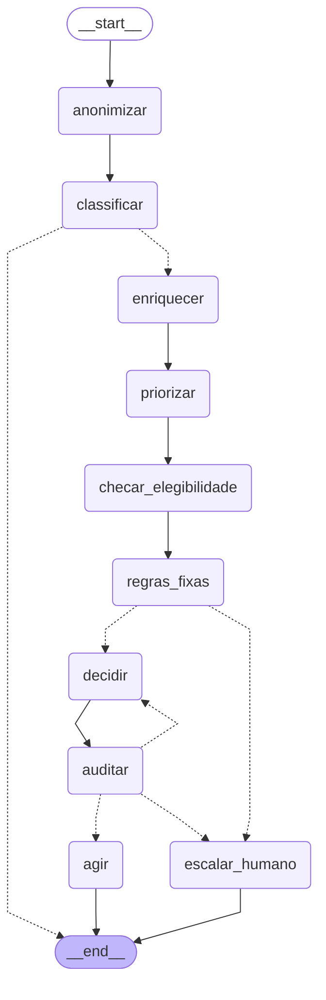

# Fluxo do agente de atendimento

```mermaid
---
config:
  flowchart:
    curve: linear
---
graph TD;
	__start__([<p>__start__</p>]):::first
	anonimizar(anonimizar)
	classificar(classificar)
	enriquecer(enriquecer)
	priorizar(priorizar)
	checar_elegibilidade(checar_elegibilidade)
	regras_fixas(regras_fixas)
	decidir(decidir)
	auditar(auditar)
	agir(agir)
	escalar_humano(escalar_humano)
	__end__([<p>__end__</p>]):::last
	__start__ --> anonimizar;
	anonimizar --> classificar;
	auditar -.-> agir;
	auditar -.-> decidir;
	auditar -.-> escalar_humano;
	checar_elegibilidade --> regras_fixas;
	classificar -.-> __end__;
	classificar -.-> enriquecer;
	decidir --> auditar;
	enriquecer --> priorizar;
	priorizar --> checar_elegibilidade;
	regras_fixas -.-> decidir;
	regras_fixas -.-> escalar_humano;
	agir --> __end__;
	escalar_humano --> __end__;
	classDef default fill:#f2f0ff,line-height:1.2
	classDef first fill-opacity:0
	classDef last fill:#bfb6fc
```
